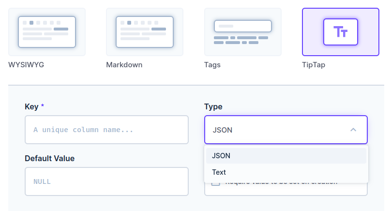
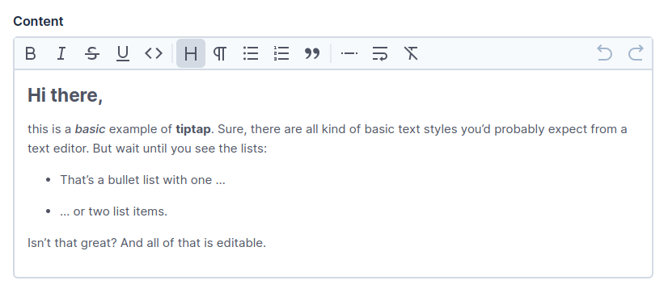
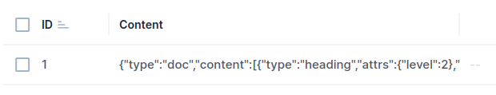
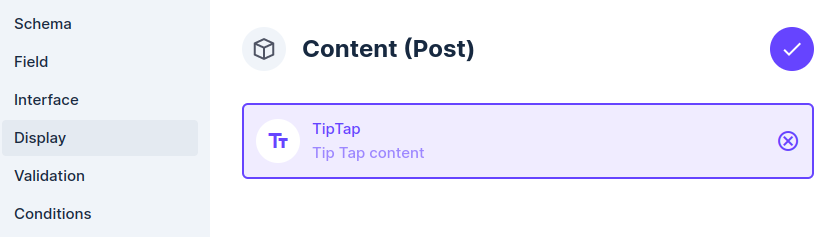
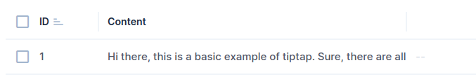

# Tiptap for Directus

[![npm version][npm-version-src]][npm-version-href]
[![npm downloads][npm-downloads-src]][npm-downloads-href]
[![License][license-src]][license-href]

This is a [Directus](https://directus.io/) extension that provides the [Tiptap](https://tiptap.dev/) editor as a rich text field type.

The [StarterKit](https://tiptap.dev/api/extensions/starter-kit) tiptap bundle is already included and the other tiptap extensions are available in the directus interface options.

- npm package : `@bicou/directus-extension-tiptap`
- [✨ &nbsp;Release Notes](/CHANGELOG.md)

## Requirements

This extension requires Directus 9 or higher to be installed.

## Installation

Add `@bicou/directus-extension-tiptap` dependency to your directus project.

```bash
# Using pnpm
pnpm add @bicou/directus-extension-tiptap
# Using yarn
yarn add @bicou/directus-extension-tiptap
# Using npm
npm install @bicou/directus-extension-tiptap
```

## Usage

### Field

When creating a field in Directus choose TipTap.



Choosing **Type** allows you to store your content as a JSON object or as a good old HTML string

- _JSON_ : the JSON object of the [ProseMirror](https://prosemirror.net/) nodes
- _Text_ : the HTML content as string

### Editor

When editing content items, the Tiptap WYSIWG editor will show up :



### Field data and display

By default, the data is shown as raw JSON :



Edit the field to select Tiptap as display ...



... to render the text of the field in content browsing :



## License

This extension is released under the MIT license. See the LICENSE file for more details.

<!-- Badges -->

[npm-version-src]: https://img.shields.io/npm/v/@bicou/directus-extension-tiptap/latest.svg?style=flat&colorA=18181B&colorB=28CF8D
[npm-version-href]: https://npmjs.com/package/@bicou/directus-extension-tiptap
[npm-downloads-src]: https://img.shields.io/npm/dm/@bicou/directus-extension-tiptap.svg?style=flat&colorA=18181B&colorB=28CF8D
[npm-downloads-href]: https://npmjs.com/package/@bicou/directus-extension-tiptap
[license-src]: https://img.shields.io/npm/l/@bicou/directus-extension-tiptap.svg?style=flat&colorA=18181B&colorB=28CF8D
[license-href]: https://npmjs.com/package/@bicou/directus-extension-tiptap
